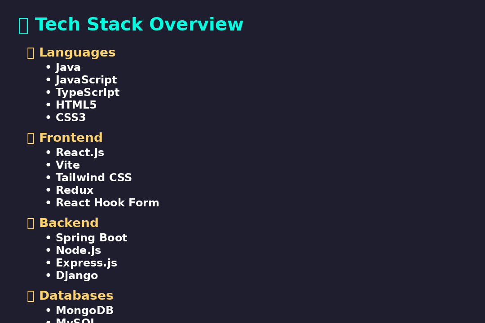

# 👋 Hello, I'm Harsh Raj Singh Rathore

🚀 Full Stack Developer | Java + MERN Enthusiast | Passionate Builder

---

## 🧭 Developer Journey

```yaml
2022:
  - 🚪 Entered B.Tech in IT at M.L.V. Textile College
  - 💻 Started with Java & Web Development Basics

2023:
  - 📚 Learned React.js, Spring Boot, Firebase
  - 🛠️ Created Student Management System & 2048 Game
  - 🧠 Explored Backend APIs & Authentication

2024:
  - 🏆 Won CreateX Hackathon – Built 2D Virtual Co-working Office
  - 🌐 Built & Deployed Full Stack Projects with GitHub Actions
  - 🧑‍🤝‍🧑 Collaborated on Open Source & Learned Docker + AWS

2025:
  - 🛠️ Sharpening Backend + DevOps
  - 🌟 Preparing for Advanced Product Building
  - ✨ Working on Personal Projects & Portfolio Polish
```

---

## 🛠️ Tech Toolbox

> 🖼️ Here's what powers my projects



---

## 🎯 Focus Areas
- 🔐 Authentication Systems
- ☁️ Cloud Deployment & CI/CD
- 🏗️ Scalable Backend Architecture
- 🎨 Clean, Minimal UI Design

---

## 📬 Connect With Me
- ✉️ [raj.harsh0123456@gmail.com](mailto:raj.harsh0123456@gmail.com)
- 🔗 [LinkedIn](https://www.linkedin.com/in/harshraj09)
- 🐙 [GitHub](https://github.com/harshraj09)

---

🧠 “Great software is built with obsession to details and passion to improve.”
